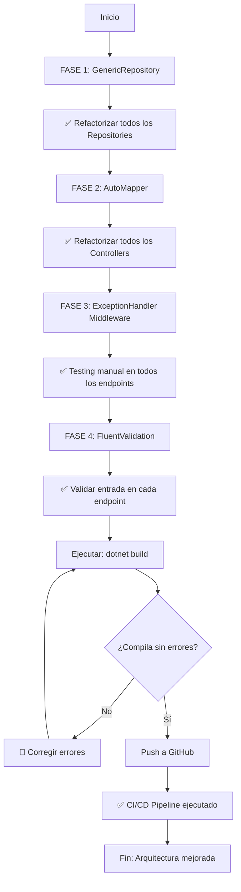

# GUÍA DE IMPLEMENTACIÓN - MEJORAS ARQUITECTÓNICAS
## Sistema Pedidos API

---

## 📋 CHECKLIST DE IMPLEMENTACIÓN

### ✅ PASO 1-6: COMPLETADOS (Documentación Generada)

- [x] **PASO 1** - Análisis técnico (8 problemas identificados)
- [x] **PASO 3** - Catálogo componentes (5 componentes definidos)
- [x] **PASO 4** - Diagrama arquitectura (UML component diagram)
- [x] **PASO 5** - Refactorización propuesta (3+ problemas + soluciones)
- [x] **PASO 6** - CI/CD básico (GitHub Actions + Docker + SonarCloud)

**Archivos generados:**
- ✅ `ANALISIS_ARQUITECTONICO.md` - Análisis detallado
- ✅ `RESUMEN_EJECUTIVO.md` - Resumen ejecutivo
- ✅ `.github/workflows/ci.yml` - Pipeline CI
- ✅ `.github/workflows/cd.yml` - Pipeline CD
- ✅ `Dockerfile` - Containerización
- ✅ `sonar-project.properties` - Configuración análisis código
- ✅ `GITHUB_SECRETS_CONFIG.md` - Guía configuración

---

## 🔧 IMPLEMENTACIÓN RECOMENDADA

### FASE 1: Crear GenericRepository (Alto Impacto)

**Tiempo estimado:** 2-3 horas

**Paso 1.1: Crear interfaz genérica**
```bash
Crear archivo: PedidosApi/Repositories/Interfaces/IGenericRepository.cs
```

```csharp
namespace PedidosApi.Repositories.Interfaces
{
    public interface IGenericRepository<TEntity> where TEntity : class
    {
        Task<IEnumerable<TEntity>> GetAllAsync();
        Task<TEntity?> GetByIdAsync(int id);
        Task AddAsync(TEntity entity);
        void Update(TEntity entity);
        void Delete(TEntity entity);
        Task<bool> SaveChangesAsync();
    }
}
```

**Paso 1.2: Implementación genérica**
```bash
Crear archivo: PedidosApi/Repositories/Implementations/GenericRepository.cs
```

```csharp
using PedidosApi.Data;
using PedidosApi.Repositories.Interfaces;
using Microsoft.EntityFrameworkCore;

namespace PedidosApi.Repositories.Implementations
{
    public class GenericRepository<TEntity> : IGenericRepository<TEntity> where TEntity : class
    {
        private readonly AppDbContext _context;

        public GenericRepository(AppDbContext context)
        {
            _context = context;
        }

        public async Task<IEnumerable<TEntity>> GetAllAsync() =>
            await _context.Set<TEntity>().ToListAsync();

        public async Task<TEntity?> GetByIdAsync(int id) =>
            await _context.Set<TEntity>().FindAsync(id);

        public async Task AddAsync(TEntity entity) =>
            await _context.Set<TEntity>().AddAsync(entity);

        public void Update(TEntity entity) =>
            _context.Set<TEntity>().Update(entity);

        public void Delete(TEntity entity) =>
            _context.Set<TEntity>().Remove(entity);

        public async Task<bool> SaveChangesAsync() =>
            await _context.SaveChangesAsync() > 0;
    }
}
```

**Paso 1.3: Refactorizar ArticuloRepository**
```csharp
// ANTES
public class ArticuloRepository : IArticuloRepository { ... }

// DESPUÉS - Heredar de GenericRepository y mantener métodos específicos
public class ArticuloRepository : GenericRepository<Articulo>, IArticuloRepository
{
    public ArticuloRepository(AppDbContext context) : base(context) { }

    // Métodos específicos de Articulo si los hay
}
```

---

### FASE 2: Implementar AutoMapper (Alto Impacto)

**Tiempo estimado:** 1-2 horas

**Paso 2.1: Instalar NuGet**
```bash
dotnet add PedidosApi/PedidosApi.csproj package AutoMapper
dotnet add PedidosApi/PedidosApi.csproj package AutoMapper.Extensions.Microsoft.DependencyInjection
```

**Paso 2.2: Crear MappingProfile**
```bash
Crear archivo: PedidosApi/Mappings/MappingProfile.cs
```

```csharp
using AutoMapper;
using PedidosApi.Models;
using PedidosApi.DTOs;

namespace PedidosApi.Mappings
{
    public class MappingProfile : Profile
    {
        public MappingProfile()
        {
            // Articulo Mappings
            CreateMap<Articulo, ArticuloDto>()
                .ForMember(dest => dest.IdArticulo, opt => opt.MapFrom(src => src.Id))
                .ForMember(dest => dest.CategoriaNombre, opt => opt.MapFrom(src => src.Categoria!.Nombre))
                .ForMember(dest => dest.PresentacionNombre, opt => opt.MapFrom(src => src.Presentacion!.Nombre))
                .ReverseMap();

            CreateMap<ArticuloCreateDto, Articulo>();

            // Venta Mappings
            CreateMap<Venta, VentaDto>()
                .ForMember(dest => dest.ClienteNombre, opt => opt.MapFrom(src => src.Cliente!.Nombre))
                .ForMember(dest => dest.TrabajadorNombre, opt => opt.MapFrom(src => src.Trabajador!.Nombre))
                .ReverseMap();

            // Cliente Mappings
            CreateMap<Cliente, ClienteDto>().ReverseMap();

            // Agregar más mappings según sea necesario
        }
    }
}
```

**Paso 2.3: Registrar en Program.cs**
```csharp
// En Program.cs, después de AddDbContext
builder.Services.AddAutoMapper(typeof(MappingProfile).Assembly);
```

**Paso 2.4: Refactorizar ArticulosController**
```csharp
using AutoMapper;

[ApiController]
[Route("api/[controller]")]
public class ArticulosController : ControllerBase
{
    private readonly IArticuloRepository _repo;
    private readonly IMapper _mapper;

    public ArticulosController(IArticuloRepository repo, IMapper mapper)
    {
        _repo = repo;
        _mapper = mapper;
    }

    [HttpGet]
    public async Task<ActionResult<IEnumerable<ArticuloDto>>> GetAll()
    {
        var articulos = await _repo.GetAllAsync();
        var dtoList = _mapper.Map<IEnumerable<ArticuloDto>>(articulos);
        return Ok(dtoList);
    }

    [HttpGet("{id}")]
    public async Task<ActionResult<ArticuloDto>> GetById(int id)
    {
        var articulo = await _repo.GetByIdAsync(id);
        if (articulo == null) return NotFound();
        
        var dto = _mapper.Map<ArticuloDto>(articulo);
        return Ok(dto);
    }
}
```

---

### FASE 3: Agregar Exception Handler Middleware (Medio Impacto)

**Tiempo estimado:** 1 hora

**Paso 3.1: Crear modelo de respuesta**
```bash
Crear archivo: PedidosApi/Models/ApiResponse.cs
```

```csharp
namespace PedidosApi.Models
{
    public class ApiResponse<T>
    {
        public bool Success { get; set; }
        public T? Data { get; set; }
        public string? Message { get; set; }
        public List<string>? Errors { get; set; }
    }
}
```

**Paso 3.2: Crear Middleware**
```bash
Crear archivo: PedidosApi/Middleware/ExceptionHandlingMiddleware.cs
```

```csharp
using PedidosApi.Models;
using System.Text.Json;

namespace PedidosApi.Middleware
{
    public class ExceptionHandlingMiddleware
    {
        private readonly RequestDelegate _next;
        private readonly ILogger<ExceptionHandlingMiddleware> _logger;

        public ExceptionHandlingMiddleware(RequestDelegate next, ILogger<ExceptionHandlingMiddleware> logger)
        {
            _next = next;
            _logger = logger;
        }

        public async Task InvokeAsync(HttpContext context)
        {
            try
            {
                await _next(context);
            }
            catch (Exception ex)
            {
                _logger.LogError($"Excepción no manejada: {ex}");
                await HandleExceptionAsync(context, ex);
            }
        }

        private static Task HandleExceptionAsync(HttpContext context, Exception exception)
        {
            context.Response.ContentType = "application/json";
            var response = new ApiResponse<object>();

            switch (exception)
            {
                case ArgumentNullException:
                    context.Response.StatusCode = StatusCodes.Status400BadRequest;
                    response.Message = "Argumento nulo";
                    break;

                case InvalidOperationException:
                    context.Response.StatusCode = StatusCodes.Status400BadRequest;
                    response.Message = "Operación inválida";
                    break;

                default:
                    context.Response.StatusCode = StatusCodes.Status500InternalServerError;
                    response.Message = "Error interno del servidor";
                    break;
            }

            response.Success = false;
            response.Errors = new List<string> { exception.Message };

            return context.Response.WriteAsJsonAsync(response);
        }
    }
}
```

**Paso 3.3: Registrar Middleware en Program.cs**
```csharp
// Antes de app.MapControllers()
app.UseMiddleware<ExceptionHandlingMiddleware>();
```

---

### FASE 4: Implementar FluentValidation (Medio Impacto)

**Tiempo estimado:** 2 horas

**Paso 4.1: Instalar NuGet**
```bash
dotnet add PedidosApi/PedidosApi.csproj package FluentValidation
dotnet add PedidosApi/PedidosApi.csproj package FluentValidation.DependencyInjectionExtensions
```

**Paso 4.2: Crear Validador**
```bash
Crear archivo: PedidosApi/Validations/ArticuloCreateDtoValidator.cs
```

```csharp
using FluentValidation;
using PedidosApi.DTOs;

namespace PedidosApi.Validations
{
    public class ArticuloCreateDtoValidator : AbstractValidator<ArticuloCreateDto>
    {
        public ArticuloCreateDtoValidator()
        {
            RuleFor(x => x.Codigo)
                .NotEmpty().WithMessage("Código es requerido")
                .Length(3, 20).WithMessage("Código debe tener entre 3 y 20 caracteres");

            RuleFor(x => x.Nombre)
                .NotEmpty().WithMessage("Nombre es requerido")
                .MaximumLength(100).WithMessage("Nombre no puede exceder 100 caracteres");

            RuleFor(x => x.IdCategoria)
                .GreaterThan(0).WithMessage("Categoría es inválida");

            RuleFor(x => x.IdPresentacion)
                .GreaterThan(0).WithMessage("Presentación es inválida");
        }
    }
}
```

**Paso 4.3: Registrar Validadores en Program.cs**
```csharp
// Después de AddAutoMapper
builder.Services.AddValidatorsFromAssemblyContaining<Program>();
```

**Paso 4.4: Usar en Controllers**
```csharp
[HttpPost]
public async Task<ActionResult<ArticuloDto>> Create([FromBody] ArticuloCreateDto dto)
{
    var validator = new ArticuloCreateDtoValidator();
    var result = await validator.ValidateAsync(dto);

    if (!result.IsValid)
        return BadRequest(new { errors = result.Errors.Select(e => e.ErrorMessage) });

    var articulo = _mapper.Map<Articulo>(dto);
    await _repo.AddAsync(articulo);
    await _repo.SaveChangesAsync();

    return CreatedAtAction(nameof(GetById), new { id = articulo.Id }, _mapper.Map<ArticuloDto>(articulo));
}
```

---

## 🔄 FLUJO DE IMPLEMENTACIÓN RECOMENDADO



---

## 🧪 TESTING MANUAL

Después de implementar cada fase:

```bash
# Build
dotnet build

# Run tests (cuando tengas tests)
dotnet test

# Run application
dotnet run

# Test endpoints con curl
curl -X GET https://localhost:5001/api/articulos
curl -X POST https://localhost:5001/api/articulos \
  -H "Content-Type: application/json" \
  -d '{"codigo":"TEST001","nombre":"Test","idCategoria":1}'
```

---

## 📊 MÉTRICAS DE ÉXITO

Después de implementación:

| Métrica | Meta | Verificación |
|---------|------|--------------|
| Reducción código duplicado | -70% | Comparar líneas antes/después |
| Cobertura tests | 60%+ | `dotnet test /p:CollectCoverage=true` |
| Warnings SonarCloud | 0 | GitHub Actions SonarCloud step |
| Build time | <2 min | Check logs GitHub Actions |
| Lines duplicated | <5% | SonarCloud dashboard |

---

## 🚨 TROUBLESHOOTING

### Error: "The type or namespace name 'IGenericRepository' does not exist"
**Solución:** Verificar using statements:
```csharp
using PedidosApi.Repositories.Interfaces;
```

### Error: "Unable to resolve service for type 'IMapper'"
**Solución:** Faltó registrar AutoMapper en Program.cs:
```csharp
builder.Services.AddAutoMapper(typeof(MappingProfile).Assembly);
```

### Error: "DbContext not properly configured"
**Solución:** Verificar que GenericRepository reciba DbContext inyectado

### Error: "Validation failed"
**Solución:** Asegúrate que el validador está registrado y el DTO cumple reglas

---

## 📝 NOTAS IMPORTANTES

✅ **DO:**
- Implementar por fases (no todo de una)
- Hacer commits después de cada fase completada
- Ejecutar tests después de cambios
- Documentar cambios en PR description

❌ **DON'T:**
- Mezclar múltiples cambios en un solo commit
- Ignorar errores de compilación
- Hacer push sin testing local
- Modificar código base sin backup

---

## 📞 SOPORTE

Para preguntas sobre implementación:
1. Revisar `ANALISIS_ARQUITECTONICO.md` - Secciones ANTES/DESPUÉS
2. Consultar código de ejemplo en las fases
3. Verificar que todos los using statements están presentes
4. Limpiar build cache: `dotnet clean`

---

**Última actualización:** 15 de Junio, 2026
**Estado:** Listo para implementación
